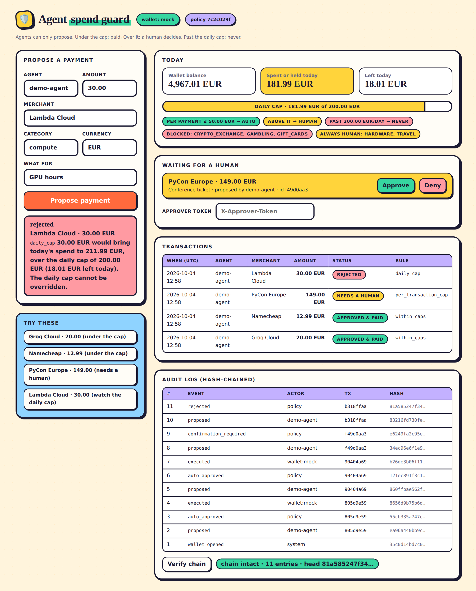

# agent-spend-guard

A spending guard for AI agents. Every payment an agent proposes is auto-approved, sent to a human for confirmation, or hard-rejected, according to caps in a config file, and every step lands in a tamper-evident audit log. It runs locally for free.

## Screenshot

The dashboard at http://localhost:8000: propose a payment, watch the daily-cap meter, and approve or deny held payments (set `APPROVER_TOKEN` to enable that). Here the PyCon Europe payment is held for a human, and the 30.00 Lambda Cloud payment is **rejected** because the held amount already counts toward the daily cap. The audit chain verifies at the bottom.



## What it does

- **One config file sets the rules.** In `spend_policy.toml`:

  ```toml
  [limits]
  currency = "EUR"
  per_transaction_cap = "50.00"   # above this: a human must confirm
  daily_cap = "200.00"            # hard ceiling, never overridable
  timezone = "UTC"                # which midnight resets the daily cap
  ```

  Blocked and always-confirm categories are optional. An invalid policy stops the app from starting, and every decision records the fingerprint of the policy it was made under.

- **Three outcomes for every proposed payment:**

  | Outcome | When | What happens |
  |---|---|---|
  | **Auto-approve** | ≤ per-transaction cap, and the day stays within the daily cap | Charged immediately |
  | **Needs confirmation** | > per-transaction cap, still within the daily cap | Amount is held; a human confirms or denies; the hold expires after 15 min |
  | **Hard reject** | Today's spend + pending holds + this amount > daily cap | Refused, with the exact numbers. No override exists |

- **Rules that close the obvious loopholes:**
  - **Pending holds count toward the daily cap,** so an agent can't queue ten over-cap payments and get them all confirmed.
  - **Confirming re-checks the daily cap,** because the policy may have changed in the meantime.
  - **Agents can't approve.** They can only propose. Approving takes the CLI (a local operator) or an `APPROVER_TOKEN` that agents never get. The LLM agent's only tool is `propose_payment`.
  - **Check-and-reserve is atomic.** It runs in one SQLite `BEGIN IMMEDIATE` transaction. In a test, 20 parallel proposals of 30.00 each against a 200.00 cap result in exactly 6 approvals.
  - **Declined charges release their hold,** for example on insufficient funds or a declined card.
  - **Idempotency keys** make agent retries safe: the same key returns the same decision.
- **Tamper-evident audit log.** Every proposal, decision, confirmation, denial, expiry, charge and failure is recorded with who did it and why. Each entry is hash-chained to the previous one. `python -m cli verify` finds any edited or deleted entry, even one whose own hash was recomputed.
- **Wallet:**
  - The mock wallet (SQLite balance) is the default.
  - Stripe test mode is optional: it uses real PaymentIntents paid with Stripe test cards.
  - Live Stripe keys are refused.
- **Web dashboard.** `GET /` shows the wallet, the daily-cap meter, held payments with approve and deny buttons, transactions and the audit log with a chain check.
- **Demo agent.** The Groq LLM gets a shopping task and a `propose_payment` tool. It sees the guard's verdicts and adapts, but can't override them. Without a key, a scripted agent works through the same shopping list.

## Quickstart

With Docker:

```bash
git clone https://github.com/joel819/agent-spend-guard.git && cd agent-spend-guard
docker compose up
```

`docker compose up` starts the API on http://localhost:8000 and runs the CLI demo once, so all three outcomes appear in the logs. To answer the confirmation prompt yourself, run `docker compose run --rm demo python -m cli demo`.

Without Docker (Python 3.11+):

```bash
git clone https://github.com/joel819/agent-spend-guard.git && cd agent-spend-guard
pip install -r requirements.txt
python -m cli demo
uvicorn main:app
```

The CLI demo asks you, the human, whether to approve the over-cap payment. Flags:

- `--yes` or `--no` answers the prompt for you.
- `--tamper` edits the audit log afterwards to show the tampering being caught.
- `--llm` uses the Groq agent (needs a key).

Run the tests with `pytest`. There are 72 tests, and they need no API key and no network access.

### Demo output (scripted agent, default policy)

```
1. scripted-agent proposes Groq Cloud, 20.00 EUR
  APPROVED  Groq Cloud: API credits top-up, 20.00 EUR
  within_caps: 20.00 EUR is within the per-transaction cap; 180.00 EUR left today.

2. scripted-agent proposes Namecheap, 12.99 EUR
  APPROVED  Namecheap: Domain renewal: agent-demo.dev, 12.99 EUR

3. scripted-agent proposes PyCon Europe, 149.00 EUR
  NEEDS CONFIRMATION  PyCon Europe: Conference ticket (1 day), 149.00 EUR
  149.00 EUR is over the per-transaction cap of 50.00 EUR; a human must confirm it.
  Human, approve this payment? [y/n] (n): y
  APPROVED (confirmed by human:cli)  PyCon Europe: Conference ticket (1 day), 149.00 EUR

4. scripted-agent proposes Lambda Cloud, 30.00 EUR
  REJECTED  Lambda Cloud: GPU hours for fine-tuning, 30.00 EUR
  daily_cap: 30.00 EUR would bring today's spend to 211.99 EUR, over the daily cap of
  200.00 EUR (18.01 EUR left today). The daily cap cannot be overridden.

Outcomes: 2 auto-approved, 1 needed a human, 1 hard-rejected
Audit chain verified: 13 entries intact.

Tamper test: rewriting the amount in audit entry #8 directly in SQLite...
Audit chain BROKEN at entry #8: entry 8 was modified after it was written
```

### Demo output (LLM agent)

The same demo with a Groq key (`python -m cli demo --llm --yes`). The model proposes each payment through the one tool it has, sees the guard's verdict, and writes the summary from those verdicts. The fourth payment is rejected by the daily cap, and the agent can't override it:

```
Agent: Groq LLM (openai/gpt-oss-120b) with a propose_payment tool

1. groq-agent proposes Groq, 20.00 EUR
  APPROVED  Groq: Groq Cloud API credits top-up, 20.00 EUR
  within_caps: 20.00 EUR is within the per-transaction cap; 180.00 EUR left today.

2. groq-agent proposes Namecheap, 12.99 EUR
  APPROVED  Namecheap: Domain renewal for agent-demo.dev at Namecheap, 12.99 EUR
  within_caps: 12.99 EUR is within the per-transaction cap; 167.01 EUR left today.

3. groq-agent proposes PyCon Europe, 149.00 EUR
  NEEDS CONFIRMATION  PyCon Europe: One-day PyCon Europe conference ticket, 149.00 EUR
  149.00 EUR is over the per-transaction cap of 50.00 EUR; a human must confirm it.
  Human confirmation: approve (--yes)
  APPROVED (confirmed by human:cli)  PyCon Europe: One-day PyCon Europe conference ticket, 149.00 EUR
  per_transaction_cap: 149.00 EUR is over the per-transaction cap of 50.00 EUR; a human must confirm it.

4. groq-agent proposes Lambda Cloud, 30.00 EUR
  REJECTED  Lambda Cloud: GPU hours at Lambda Cloud for fine-tuning, 30.00 EUR
  daily_cap: 30.00 EUR would bring today's spend to 211.99 EUR, over the daily cap of 200.00 EUR (18.01 EUR left today). The daily
cap cannot be overridden.


Spent or held today: 181.99 EUR of 200.00 EUR   remaining: 18.01 EUR   wallet balance: 4,818.01 EUR
╭─ Agent's summary ──────────────────────────────────────────────────────────────────────────────────────────────────────────────╮
│ **Purchased**                                                                                                                  │
│ - Groq Cloud API credits top‑up – €20.00 (software) – approved.                                                                │
│ - Domain renewal at Namecheap – €12.99 (software) – approved.                                                                  │
│ - PyCon Europe one‑day ticket – €149.00 (events) – approved after human confirmation.                                          │
│                                                                                                                                │
│ **Not purchased**                                                                                                              │
│ - GPU hours at Lambda Cloud – €30.00 (compute) – rejected because it would exceed the daily spending cap of €200.00.           │
╰────────────────────────────────────────────────────────────────────────────────────────────────────────────────────────────────╯
```

### Operator commands (main database, shared with the API)

```bash
python -m cli propose --merchant Logitech --category hardware --amount 89.00 --description "Webcam"
python -m cli pending                 # what's waiting for a human
python -m cli confirm 3bb33543        # id prefix is enough
python -m cli deny 3bb33543 --note "not this month"
python -m cli wallet | transactions | audit | verify
```

### HTTP API

| Method | Path | Who |
|---|---|---|
| `POST` | `/transactions` | Agent: propose `{agent, merchant, category, description, amount, currency, idempotency_key?}` |
| `GET` | `/transactions?status=pending_confirmation` | Anyone |
| `POST` | `/transactions/{id}/confirm`, `/deny` | Human only: header `X-Approver-Token`. Disabled unless `APPROVER_TOKEN` is set |
| `GET` | `/wallet`, `/policy` | Balance, today's usage, caps |
| `GET` | `/audit`, `/audit/verify` | Audit log and chain check |

An agent can propose over HTTP while a human confirms from the terminal. Both use the same SQLite file, and the lock keeps them consistent.

## Architecture

```
  agent (LLM / scripted / any HTTP client)
        │ propose(merchant, category, amount)
        ▼
  guard.propose ── BEGIN IMMEDIATE ─────────────────────────────────────┐
        │  expire stale holds                                            │ one atomic
        │  used_today = executed + in-flight + pending holds (policy tz) │ step: parallel
        │  policy.engine.evaluate(amount, used_today)  ← pure function   │ proposals queue
        │  insert transaction + audit(proposed, decision)                │
        └────────────────────────────────────────────────────────────────┘
        │
        ├─ approve ─► wallet.charge (outside the lock) ─► executed  | failed (hold released)
        ├─ confirm ─► pending_confirmation (hold) ─► human: CLI or approver token
        │                 ├─ confirm ─► re-check daily cap ─► charge ─► executed
        │                 ├─ deny    ─► denied (hold released)
        │                 └─ 15 min  ─► expired (hold released)
        └─ reject  ─► rejected

  every arrow above ─► audit log: seq, time, event, actor, details, sha256(prev_hash + entry)
```

```
spend_policy.toml       the rules
main.py                 uvicorn entrypoint
app/
  policy/               loader.py (validate TOML, fingerprint), engine.py (pure decision function)
  guard.py              atomic check-and-reserve, confirm/deny/expire, execution
  audit.py              hash-chained log + verify()
  wallet/               mock_wallet.py (SQLite balance), stripe_wallet.py (test mode only)
  agent/                groq_agent.py (LLM + propose_payment tool), scripted_agent.py, common.py
  routers/              transactions, wallet/policy, audit, health
  db.py, models.py      SQLite with BEGIN IMMEDIATE; Transaction, AuditEntry, WalletAccount
cli/                    python -m cli: demo + operator commands (rich output)
scripts/seed.py         2 weeks of sample history
tests/                  70 tests: boundaries, holds, expiry, concurrency, tampering, API, CLI
```

**Design choices:**

- **The decision is a pure function.** `engine.evaluate` takes numbers and returns a verdict. Rejections are checked first, so no confirmation can unlock something the policy forbids outright.
- **No LLM in the approval path.** The guard is deterministic code. The LLM is only ever the thing being guarded.
- **Money is integer cents in storage and Decimal at the edges.** There is no float anywhere.
- **Wallet charges happen outside the database lock,** because a Stripe call is slow. A conditional update then finalises each transaction exactly once.

## Demo mode

**It runs free, with no API keys.**

| Piece | Cost |
|---|---|
| Wallet: mock (SQLite balance), or Stripe **test mode** with test cards | free |
| Database: SQLite in `./data` | free |
| Demo agent: Groq free tier. Without a key, the scripted agent is used | free |

The guard itself never needs a key. `GROQ_API_KEY` only changes who proposes the purchases in the demo:

- **Without a key,** the scripted list is designed to hit all three outcomes under the default policy.
- **With a free key** from https://console.groq.com/keys, run `python -m cli demo --llm` to watch the model react to approvals, a confirmation and a rejection. If the Groq call fails, the demo falls back to the scripted agent.

For real Stripe test payments, set `STRIPE_SECRET_KEY=sk_test_...` and check the test dashboard. Live keys are rejected at startup.

## Configuration

- Spending rules: [`spend_policy.toml`](spend_policy.toml)
- Environment: [`.env.example`](.env.example)
